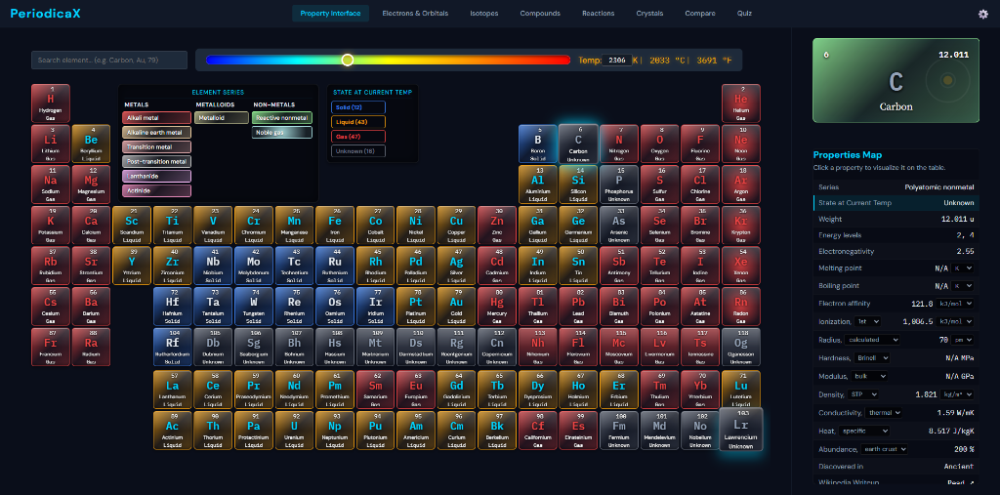
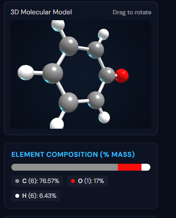
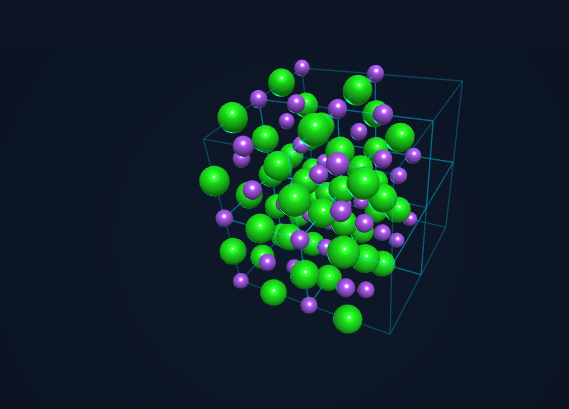
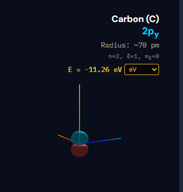
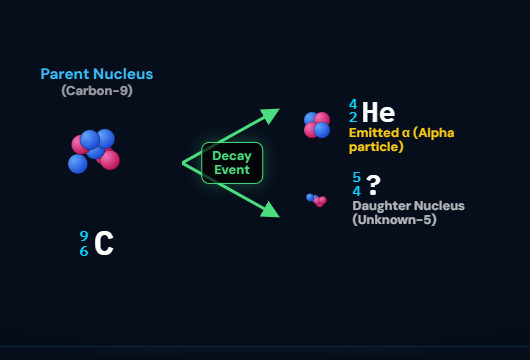

<div align="center">
  <h1>⚛️ PeriodicaX</h1>
  <p><strong>The Definitive Interactive 3D Periodic Table & Isotope Emulator</strong></p>
  
  [](https://vijay-1010110.github.io/Periodic-Table/)
  [](https://periodica-x-app.web.app)
  [](DEVELOPER_DOCS.md)
</div>

<br>

**🌐 Live Active Deployments:**
- **GitHub Pages:** [https://vijay-1010110.github.io/Periodic-Table/](https://vijay-1010110.github.io/Periodic-Table/)
- **Firebase Hosting CDN:** [https://periodica-x-app.web.app/](https://periodica-x-app.web.app/)  
**🛠️ Developer Infrastructure & Accounts Guide:** [`DEVELOPER_DOCS.md`](DEVELOPER_DOCS.md)

---

### 🎯 Direct Target URLs (Deep Linking)

PeriodicaX supports instant deep-linking via URL hash parameters across both live production environments. Click any direct targeted link below to launch PeriodicaX straight into a specific tab, element, compound, isotope, or property heatmap:

| Category / View | GitHub Pages Live Target | Firebase Hosting Live Target | Description |
| :--- | :--- | :--- | :--- |
| 🧪 **Property Interface** | [Open on GitHub Pages](https://vijay-1010110.github.io/Periodic-Table/#main) | [Open on Firebase](https://periodica-x-app.web.app/#main) | Primary 118-element periodic table view |
| ⚛️ **Electrons & Orbitals** | [Open on GitHub Pages](https://vijay-1010110.github.io/Periodic-Table/#electrons) | [Open on Firebase](https://periodica-x-app.web.app/#electrons) | 3D Quantum Orbital Cloud & Aufbau diagram |
| ☢️ **Isotopes Emulator** | [Open on GitHub Pages](https://vijay-1010110.github.io/Periodic-Table/#isotopes) | [Open on Firebase](https://periodica-x-app.web.app/#isotopes) | 3D Nuclear Cluster & Decay Emulator |
| 🧪 **3D Compounds** | [Open on GitHub Pages](https://vijay-1010110.github.io/Periodic-Table/#compounds) | [Open on Firebase](https://periodica-x-app.web.app/#compounds) | Interactive 3D Ball & Stick Molecular Models |
| 💥 **Reactions Balancer** | [Open on GitHub Pages](https://vijay-1010110.github.io/Periodic-Table/#reactions) | [Open on Firebase](https://periodica-x-app.web.app/#reactions) | Chemical Equation Balancer & Thermodynamics |
| 💎 **3D Crystals** | [Open on GitHub Pages](https://vijay-1010110.github.io/Periodic-Table/#crystals) | [Open on Firebase](https://periodica-x-app.web.app/#crystals) | 3D Unit Cell & Crystallography Inspector |
| ⚖️ **Element Comparison** | [Open on GitHub Pages](https://vijay-1010110.github.io/Periodic-Table/#compare) | [Open on Firebase](https://periodica-x-app.web.app/#compare) | Side-by-Side Dual Element Property Comparator |
| 🏆 **Chemistry Quiz** | [Open on GitHub Pages](https://vijay-1010110.github.io/Periodic-Table/#quiz) | [Open on Firebase](https://periodica-x-app.web.app/#quiz) | Interactive Periodic Table Challenge |
| 🌟 **Direct Element Links** | [Platinum (Pt)](https://vijay-1010110.github.io/Periodic-Table/#78) • [Gold (Au)](https://vijay-1010110.github.io/Periodic-Table/#Au) | [Platinum (Pt)](https://periodica-x-app.web.app/#78) • [Gold (Au)](https://periodica-x-app.web.app/#Au) | Direct link to specific element details |
| ☢️ **Direct Isotope Link** | [Carbon-14 (Isotope Decay)](https://vijay-1010110.github.io/Periodic-Table/#isotope-carbon) | [Carbon-14 (Isotope Decay)](https://periodica-x-app.web.app/#isotope-carbon) | Direct link to 3D Isotope Decay Emulator |
| 🎨 **Direct Property Heatmaps** | [Electronegativity](https://vijay-1010110.github.io/Periodic-Table/#electronegativity) | [Electronegativity](https://periodica-x-app.web.app/#electronegativity) | Direct link to property heatmap |

---

PeriodicaX is a highly interactive, visually stunning educational web application built to bring chemistry and nuclear physics to life. It moves beyond static data by providing interactive 3D electron orbital visualizations and a real-time nuclear decay emulator.

## 📸 Showcase

<div align="center">
  
  <br>
  
  
  <br>
  
  
</div>

## ✨ Features

- **Interactive Periodic Table:** Browse all 118 elements with beautiful, color-coded categorizations (glassmorphism UI, dynamic gradients).
- **3D Electron Orbitals:** Drag, rotate, and zoom into fully rendered 3D electron clouds (s, p, d, f blocks) built with Three.js.
- **Isotope Decay Emulator:** Select from hundreds of isotopes to view precise nuclear data. Watch a dynamically generated 3D nuclear cluster undergo Alpha, Beta, and Positron decay in real-time.
- **Responsive Aufbau Diagram:** An elegantly responsive electron configuration chart that scales flawlessly to any screen size.
- **Wikipedia Integration:** Learn more about any element or isotope instantly via an embedded modal bypass.
- **Auto-Updating SEO Engine:** A custom build script dynamically parses the element database to generate hundreds of targeted keywords, a sitemap, and JSON-LD structured data upon every build.

## 🛠️ Technology Stack

PeriodicaX is built entirely from scratch with zero heavy frameworks, prioritizing raw performance and vanilla mastery:
- **HTML5 & Vanilla CSS3** (No Tailwind, No Bootstrap)
- **Vanilla JavaScript (ES6)** (No React, No Vue)
- **Three.js** (For 3D rendering)
- **Python** (Custom static site generator and SEO compiler)
- **Firebase Hosting** (For global CDN delivery)

## 🚀 Quick Start (Local Development)

Since PeriodicaX uses a custom build pipeline, you need to compile the source files into the final `public/index.html` file.

1. **Clone the repository:**
   ```bash
   git clone https://github.com/Vijay-1010110/Periodic-Table.git
   cd Periodic-Table
   ```

2. **Run the build script:**
   The `build.py` script concatenates all CSS and JS, injects them into the HTML, generates the SEO tags, and outputs everything to the `public/` folder.
   ```bash
   python build.py
   ```

3. **Serve locally:**
   You can use any local web server to view the `public/` directory.
   ```bash
   cd public
   python -m http.server 8000
   ```
   Open `http://localhost:8000` in your browser.

## 🤝 Contributing

Contributions are always welcome! Whether it's adding new physical properties to the database, improving the 3D renderer, or fixing UI bugs:
1. Fork the Project
2. Create your Feature Branch (`git checkout -b feature/AmazingFeature`)
3. Run `python build.py` to ensure everything compiles.
4. Commit your Changes (`git commit -m 'Add some AmazingFeature'`)
5. Push to the Branch (`git push origin feature/AmazingFeature`)
6. Open a Pull Request

## 📄 License

Distributed under the **PeriodicaX Personal Use & Attribution License**. 
See `LICENSE` for more information.

In short:
* ✅ You can use this for personal and educational projects.
* ✅ You can modify the code.
* ❌ You may NOT publish this website publicly as your own product/website.
* ❌ You may NOT use this for commercial purposes.
* ⚠️ You must provide proper credit if you use parts of this code elsewhere.
